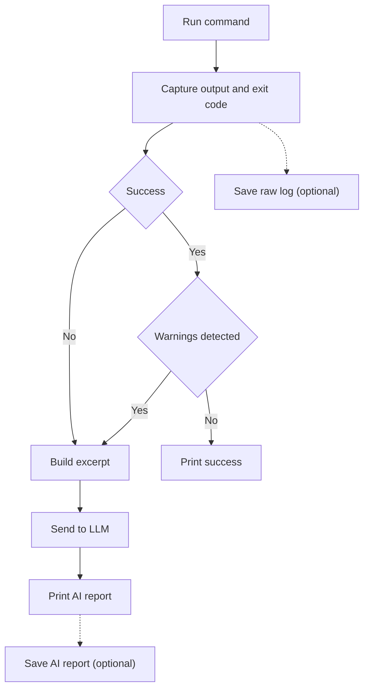

# brytlog — AI logger

[](https://pypi.org/project/brytlog/)
[](https://opensource.org/licenses/MIT)
[](https://pypi.org/project/brytlog/)

brytlog is a CLI routing tool for agents. It lets them offload log analysis to a subagent, keeping their context lean and saving tokens. Raw logs can be preserved with --save-logs as a fail-safe if the summary falls short.

For example, Claude Opus 4.8 (chief agent) might run `brytlog python run.py`, rather than the plain `python run.py`. This way, instead of having to process the entire raw output on its own (slow, expensive, bloats context), it will only get a concise summary, generated by a cheaper, faster model, such as Gemini-3-flash.

> ### Notes 
> - Even the cheaper model doesn't get the full raw dump, just the important parts, thus saving even more time and money.

In non-agentic, dev-driven workflows, brytlog simply saves the developer the time and trouble of analyzing raw output by himself, or copy-pasting lines into a coding assistant.  


## Features
- free
- open source
- platform, language and llm vendor agnostic
- minimal setup (just bring your own key, or run locally)
- no need to change existing code (just add a couple of lines to AGENTS.md)
- lightweight (~50 KB, ~1,400 lines of code)
- customizable
- privacy-minded (brytlog doesn't collect any data, and it redacts sensitive information before passing it to the LLM)


<table>
<tr>
<th>Without brytlog</th>
<th>With brytlog</th>
<th>With brytlog --json</th>
</tr>
<tr>
<td>
         
https://github.com/user-attachments/assets/e7883564-e9be-4b67-b936-134a24ced4eb

</td>
<td>
         
https://github.com/user-attachments/assets/29e3b3fa-48ad-4973-994b-6ece0097f097

</td>
<td>

https://github.com/user-attachments/assets/fd012964-8911-4501-9868-2784a7e72172

</td>

</tr>
</table>

---

# How to use

## Install

```bash
pip install brytlog
```

---

## Configure

After installation either run a command using brytlog (e.g. `brytlog node main.js`), which will launch an on-boarding config process in the terminal, or run `brytlog --config` to open a json configuration file in your default editor.

### Required fields
- LLM provider (e.g. Anthropic)
- Model (e.g. claude-haiku-4-5)
- API key (e.g. JQ.Ab9RN6W6QW7cmcnY92DIuoVtjCpKm_qfmO5T5oGzQmnwe5fjhw)

> ### Notes
> - Google Gemini: Use keys from Google AI Studio (https://aistudio.google.com/). Google Cloud Vertex AI is not natively supported yet.  
> - Custom Providers: Supports OpenAI-compatible endpoints (Ollama, vLLM, etc.) via standard `Authorization: Bearer` headers. Azure OpenAI is not natively supported yet.

### Additional required field for custom model only (Optional override for Ollama/Enterprise endpoints)
- Base URL (e.g. http://localhost:11434/v1)

---

## Use

Simply prefix any command with `brytlog`.

Syntax: `brytlog [options] <command>`.

Examples:
```bash
brytlog python run.py 
brytlog --api-key xyz... node build.js
brytlog --model claude-haiku-4-5 ./deploy.sh
```

### Chaining Multiple Commands
Wrap the entire string in quotes to run multiple commands together.

```bash
brytlog "pip install -r requirements.txt && python run.py"

brytlog "node main.js
         npm run serve"
```

## Use in agentic workflow

Either prompt inline at the beginning of a session or add this or similar to **AGENTS.md**:

```
brytlog replaces raw terminal output with a concise AI summary.

Use it for interpreters (e.g.`python`, `node`), compilers, build tools (e.g. `npm`, `make`), and test runners (e.g. `pytest`). Do not use it for standard OS utilities (e.g.`ls`, `cat`), version control (e.g.`git`), or interactive CLI tools (e.g.`htop`).

Syntax: `brytlog [options] <command>` (e.g., `brytlog --json python run.py`).
```

---

## Outcome

Instead of raw log, a short report is outputted to the terminal.  


## Example output

```text
                                   ────────────────────────────────────────────────────────────

                                                     🧠📜 brytlog crash report

Problem
The program crashed due to a TypeError when attempting to divide an integer by a string. The 'items' value from the configuration is a string and needs to be converted to an integer for arithmetic operations.

Fix
Convert payload['items'] to an integer before division in /var/folders/ys/zfg72rwd661dn0cnrsqth5sh0000gn/T/tmph1e0wuse.py, line 6:
average = payload['total'] / int(payload['items'])

Full report → /path/to/project/brytlog-reports/2026-06-15T14-11-51.log
Full raw log → /path/to/project/brytlog-raw/2026-06-15T14-11-51.txt

                                   ────────────────────────────────────────────────────────────
```

---


## CLI Flags

| Flag | Description |
|---|---|
| `--version` | Show program's version number and exit |
| `--config` | Open the configuration file |
| `--reset` | Reset configuration to defaults |
| `--upgrade` | Upgrade brytlog to the latest version on PyPI |
| `--test` | Run a simulated crash to test the LLM configuration |
| `--logs` | List recent logs from the local `brytlog-reports/` directory |
| `--provider` | LLM provider (`google`, `openai`, `anthropic`, `grok`, `ollama`, `custom`) |
| `--model` | LLM model to use (e.g., `gpt-4o-mini`) |
| `--api-key` | Pass API key inline |
| `--api-base-url` | Base URL for `custom` or `ollama` providers |
| `--json` | Output the report as JSON |
| `--no-log` | Disable writing AI reports to the local `brytlog-reports/` directory |
| `--no-raw-log` | Disable writing raw logs to the local `brytlog-raw/` directory |
| `--quiet` | Suppress the live stream of raw logs in the terminal (default) |
| `--no-quiet` | Display the live stream of raw logs in the terminal (override quiet default) |

---

## Environment Variables

| Variable | Default | Description |
|---|---|---|
| `BRYTLOG_API_KEY` | — | Required for crash reports (unless using local llm) |
| `BRYTLOG_PROVIDER` | — | LLM provider |
| `BRYTLOG_MODEL` | — | LLM model |
| `BRYTLOG_API_BASE_URL` | — | Required for `custom` provider |
| `BRYTLOG_SAVE_REPORT` | `true` | Set to `false` to disable AI report files |
| `BRYTLOG_SAVE_RAW_LOG` | `true` | Set to `false` to disable raw log files |
| `BRYTLOG_QUIET` | `true` | Set to `true` to mute live terminal output |
| `BRYTLOG_MAX_INPUT` | `4000` | Max tokens (approximate) of terminal output to keep |
| `BRYTLOG_SYSTEM_PROMPT` | (built-in) | Custom system prompt for the crash report |
| `BRYTLOG_TEMPERATURE` | `0.2` | Model temperature |
| `BRYTLOG_MAX_OUTPUT` | `1000` | Max tokens for the report. Note: API token limits are automatically padded (min 2048) to accommodate reasoning models. |


## How It Works

brytlog runs a given command as a child process, diverts its `stdout` and `stderr` away from the terminal by default, and instead only outputs a concise AI summary of the run.

Possible scenarios:

- **Clean success** (exit `0`, no warning-like keywords): reports success and sends nothing to the LLM.
- **Success with warnings** (exit `0`, keywords such as `warning`, `deprecated`, or `skipped` detected): sends a sampled head / warnings / tail excerpt to the chosen LLM for a short summary of the run.
- **Crash** (non-zero exit): sends a token-bounded head-and-tail excerpt of the output to the LLM and prints a concise problem/fix report.

Because brytlog wraps the process rather than hooking into it, it works for **any language or runtime** with no changes to the program being run.



## Notes

> - CLI flags take precedence over environment variables, which in turn take precedence over the config file.
> - Configuration is saved globally to `~/.brytlog.json` (`C:\Users\Name\.brytlog.json` on Windows). You can edit this file directly or run `brytlog --config` to open it.
> - Logs are saved locally to `brytlog-reports/` and `brytlog-raw/` in the current working directory. You may want to add `brytlog-*/` to your `.gitignore`.
> - To be clear: raw command output is muted (run in quiet mode) to humans and AI agents by default to save tokens and prevent context bloat. In quiet mode, `stdin` is redirected to `/dev/null`, meaning any interactive prompt will instantly crash the program (e.g. `EOFError`) to generate a helpful AI report rather than hanging indefinitely. Brytlog only prints the concise AI report if a command fails. To display the live stream of raw logs in the terminal as usual and answer interactive prompts, use `--no-quiet`.
> - Reasoning models (e.g., Gemini Flash-3-Preview): These models spend a large portion of their output budget on "thinking" tokens. Brytlog automatically enforces a 2048-token floor at the API level to ensure these models have room to think, while still instructing them to keep the visible report under your `MAX_OUTPUT` limit.
> - Enforcing agent use of brytlog, rather than relying on AGENTS.md or direct prompting, is also possible (e.g. via subprocess shim on PATH), but out of scope in this version. 

---

## License

MIT
